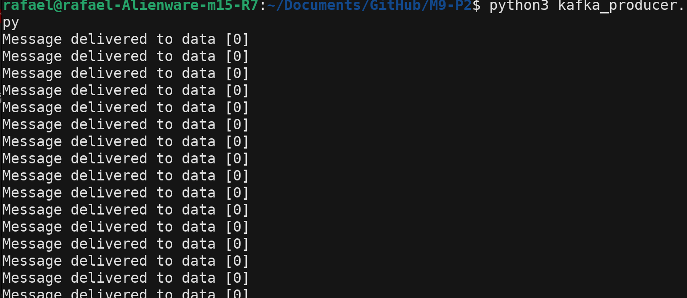
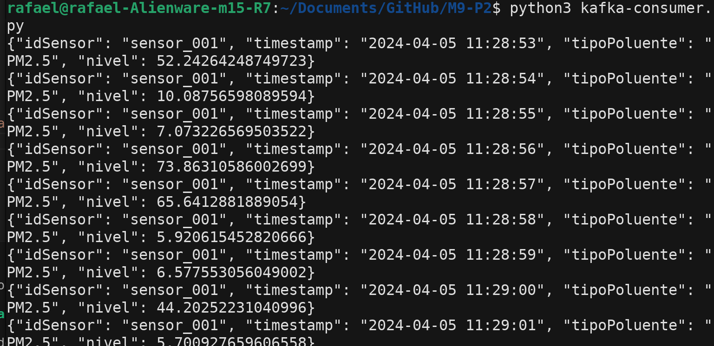

# Simulador de Sensor MQTT

Este é um simulador de producer e publisher de kafka. O producer simula o recebimento de mensagem e publica ela no kafka, o consumer faz a leitura deste topico no kafka, exibe a mensagem e salva ela no banco de dados.

## Instalação

### 1. **Clonar o Repositório:**
   ```bash
   git clone https://github.com/rafaelkatalan/M9-P2
   ```
   Vá até o repositorio no terminal.

### 2. **Instalar Dependências:**

   ```bash
   pip install confluent-kafka
   ```

   
## Uso

Dentro da pasta 'app':

### 1. **Configurar o Kafka local:**

   ```bash
   docker-compose up -d
   ```

### 2. **Executar o Simulador:**

**Publisher**:

   ```bash
   python3 kafka-producar.py
   ```
**Subscriber**:

Em um outro terminal:

   ```bash
   python3 kafka-consumer.py
   ```

   O  Producer começará a gerar leituras aleatórias e as publicará no tópico kafka especificado.Enquanto isso o consumer fará a leitura dos dados publicados e publicalos no banco de dados.

## Imagens Demonstrativas



